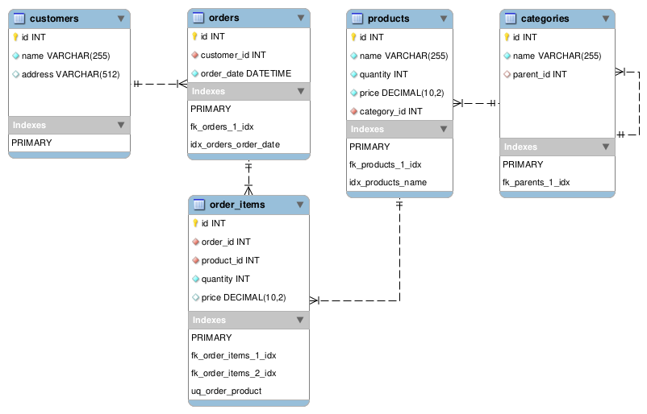

# TestApp

Проект на **Python** и **FastAPI** с **Docker** и **MySQL**

## Запуск через Docker

1) Сборка проекта:

    ```bash
    docker compose up --build
    ```

2) Наполнение БД тестовыми данными, файл seeds.py:

    ```bash
    docker compose exec api python app/seeds.py
    ```

3) Проверка работоспособности, тестирование и документация:

    [http://127.0.0.1:8000/docs](http://127.0.0.1:8000/docs)

4) Если изменили настройки и хотим пересобрать проект:

    ```bash
    docker compose down -v
    ```

## ER Diagram



Исходные файлы **EER_Diagram.mwb** и **EER_Diagram.png** в папке [docs/](docs/)

## Структура проекта

```
.
├── app
│   ├── db.py
│   ├── main.py
│   ├── models.py
│   ├── routers
│   │   └── orders.py
│   ├── seeds.py
│   └── services
│       └── orders.py
├── docker-compose.yml
├── Dockerfile
├── docs
│   ├── EER_Diagram.mwb
│   └── EER_Diagram.png
├── .env
├── .gitignore
├── init.sql
├── README.md
└── requirements.txt
```

## Переменные окружения, файл .env

```
MYSQL_HOST=db
MYSQL_USER=test_user
MYSQL_PASSWORD=12345678
MYSQL_DB=my_db
MYSQL_ROOT_PASSWORD=12345678
```

## Подключение к базе данных в Docker через клиент

- Host: localhost
- Port: 3307 (можно изменить в docker-compose.yml)
- User: test_user
- Password: 12345678
- Database: my_db

## SQL-запросы

### Сумма покупок для каждого клиента

```sql
SELECT
    c.name AS customer_name,
    SUM(oi.quantity * oi.price) AS total_amount
FROM customers c
JOIN orders o ON o.customer_id = c.id
JOIN order_items oi ON oi.order_id = o.id
GROUP BY c.id, c.name
ORDER BY total_amount DESC;
```

### Подсчёт дочерних категорий, глубина 1

```sql
SELECT
    p.id   AS category_id,
    p.name AS category_name,
    COUNT(c.id) AS children_count
FROM categories p
LEFT JOIN categories c ON c.parent_id = p.id
GROUP BY p.id, p.name
ORDER BY p.id;
```

### Топ-5 самых покупаемых товаров за последний месяц

```sql
WITH RECURSIVE category_tree AS (
    SELECT
        id,
        name,
        parent_id,
        id AS root_id,
        name AS root_name
    FROM categories
    WHERE parent_id IS NULL

    UNION ALL

    SELECT
        c.id,
        c.name,
        c.parent_id,
        ct.root_id,
        ct.root_name
    FROM categories c
    JOIN category_tree ct ON c.parent_id = ct.id
)
SELECT
    p.name AS product_name,
    ct.root_name AS root_category,
    SUM(oi.quantity) AS total_sold
FROM order_items oi
JOIN orders o ON o.id = oi.order_id
JOIN products p ON p.id = oi.product_id
JOIN category_tree ct ON ct.id = p.category_id
WHERE o.order_date >= DATE_SUB(CURRENT_DATE, INTERVAL 1 MONTH)
GROUP BY p.id, p.name, ct.root_name
ORDER BY total_sold DESC
LIMIT 5;
```

## Рекомендации по оптимизации

Для аналитики можно хранить **top_category_name** в **order_items** на дату покупки по аналогии с ценой
